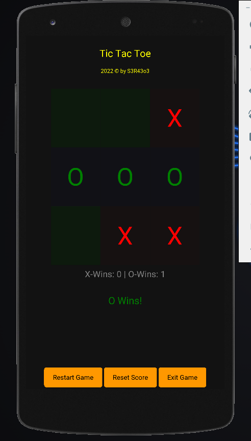
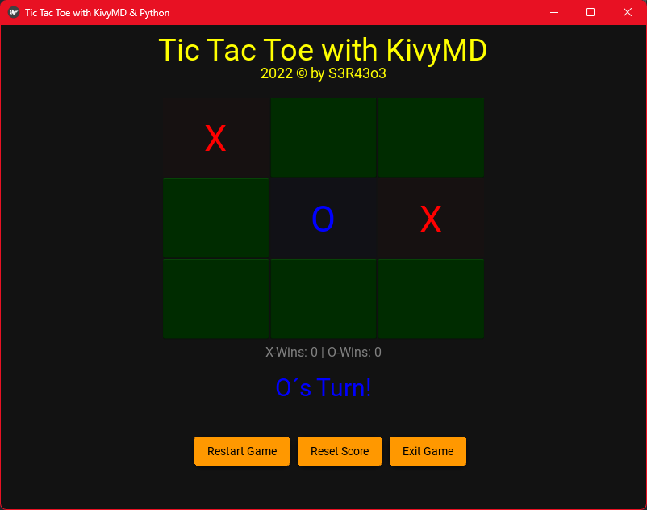

# TicTacToe Game with Python and KivyMD #

> Just a simple tictactoe game to show off how kivy works
> Feel free to edit
>
> Please Notice:
> you have to make sure kivymd is installed:
>
> ```CMD
> pip install kivymd
>```
>
>after installing kivymd just run the main.py with:
>
>```CMD
> python .\main.py
>```
>
> it is also possible to run this game on your Android device. if you want this just open a new issue with your suggestion and i will upload a .apk file


## Preview ##

